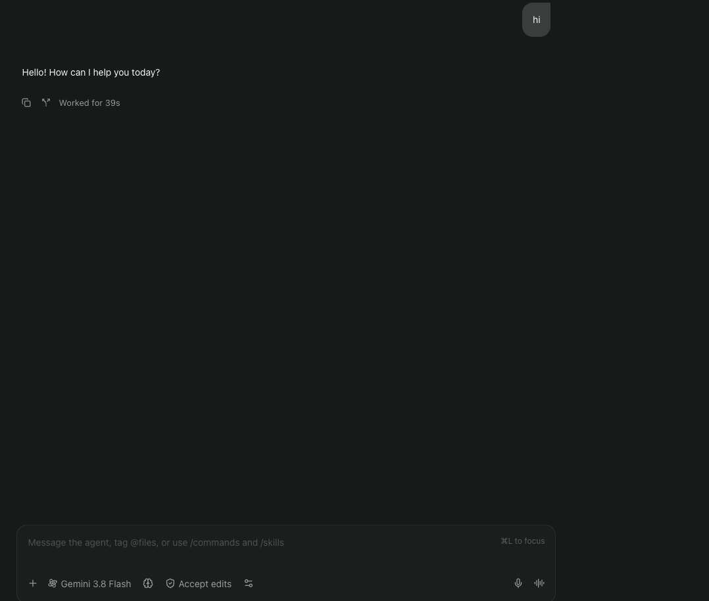
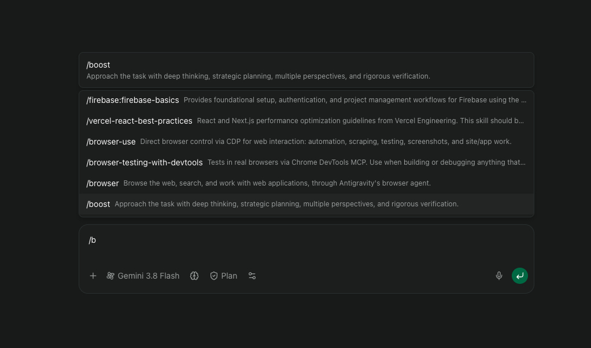
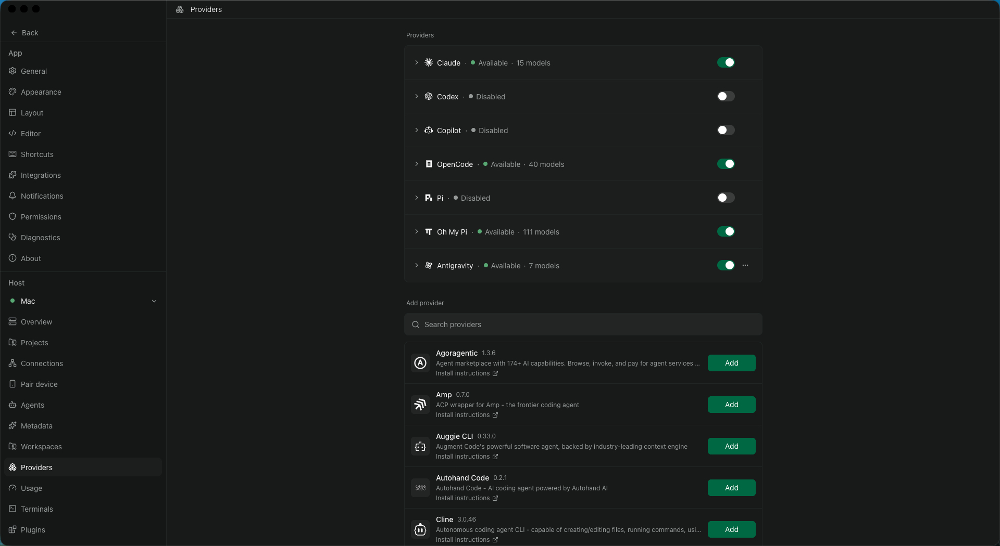
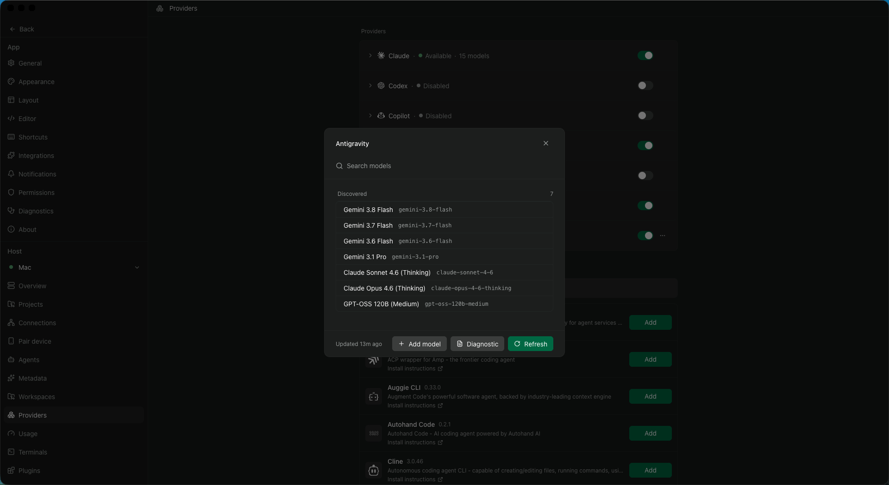

# Antigravity CLI provider for Paseo

Runs Google's official Antigravity CLI (`agy`) as a Paseo provider: Paseo owns the session, the CLI
does the work, and every turn, tool call, and message is rendered from the CLI's `stream-json`
protocol. Nothing about Antigravity is reimplemented — the plugin spawns the `agy` binary that is
already installed and signed in on your machine.

- Provider id: `antigravity-cli`
- Requires: Paseo ≥ 0.9.1 (provider protocol version 1), Node 24 for the plugin process, and
  Antigravity CLI 1.2.9–1.2.11 for the behaviour described below.

## Screenshots






## Install

From npm, from GitHub, or by pasting either source into **Settings → Plugins → Plugin source**:

```
paseo plugin install npm:paseo-plugin-antigravity-cli
paseo plugin install github:lefos13/paseo-plugin-antigravity-cli
```

Check it with `paseo plugin ls`; `antigravity-cli` should be `running`. `agy --version` must print and
`agy` must be signed in, and then pick **Antigravity** when you start a new agent.

Unlike [`agy-provider`](https://paseo.cafe/plugins/agy-provider), which adapts Antigravity's ACP
server through Paseo's ACP shim, this plugin drives the `agy` CLI directly over its documented
`stream-json` mode. The `agy` it launches is the first of `providerOptions.agyPath`,
`PASEO_ANTIGRAVITY_BIN`, `~/.local/bin/agy` (checked explicitly, because a daemon started by a GUI app
often has no such directory on `PATH`), then `agy` from `PATH`.

## What the plugin supports

One `agy` process per session: each prompt is one NDJSON turn and exactly one `result` back, and a
prompt sent while a turn runs is queued by the CLI as the next turn. Model, tier, mode, and settings
are launch flags, so a change restarts the CLI on the next turn and resumes the same conversation;
Antigravity conversations can be imported read-only, the conversation id agy reports is persisted,
each subagent becomes a child session ([Subagents](#subagents)), and `permission` covers plan approval
only. Images go over by file, because a `stream-json` turn carries text only.

Models come from `agy models` (cached ten minutes; `force` rediscovers), so the composer offers one
model per family with the tiers that family has — High, Medium and Low today. `providerOptions.effort`
is described in the table below.

Modes are *Default* (review file writes before they run), *Accept edits*, and *Plan*; tool rows cover
shell commands, file edits with a diff, searches, web fetches, and MCP tool calls.

### Plan mode

agy's own `--mode plan` is never passed: on 1.2.11 it either has no effect, while slash-command
expansion is disabled, or approves its own plan review — nobody can answer that in a headless run —
and implements in the same turn. Plan mode is therefore the plugin's own: a plan-mode turn is prefixed
with a `<plan_mode>` block telling the model to investigate read-only and end with a plan, and its last
answer is then offered as a plan (`kind: "plan"` permission) with **Implement** and **Keep planning**.
*Implement* switches to *Accept edits* and sends `The plan is approved. Implement it now.`; *Keep
planning*, or another message, withdraws it. It is an instruction, not a sandbox: a model that ignores
it can still write files.

### Background commands

When the model starts a long-running command in the background, agy holds back every later step until
it exits. After 5 s of that the plugin reads the conversation's own transcript, publishes the held
steps, and completes the turn as soon as the transcript shows the final answer. The CLI holding the
command is left running, so the server stays up (a notice says so), but it cannot take another turn:
your next message stops it, and the command with it, and resumes the conversation in a fresh CLI.

## Subagents

`invoke_subagent` starts each subagent as its own conversation while the parent turn stays open. The
plugin shows a **row per subagent** in the parent timeline (type, role, prompt, *running* until it
finishes) and a **child session per subagent** following the transcript agy names for it: the prompt,
each tool call with its result, and the final answer. A child spawned with `Workspace: branch` runs in
its own git worktree, which becomes that child session's working directory; a `Workspace: inherit`
child keeps the parent's.

The transcript is agy-internal and undocumented, so a child session is best-effort: a missing,
unreadable, or unrecognised transcript leaves the row above in place and never affects the parent turn.
Following stops when the subagent finishes, the session closes, or the turn is interrupted or fails.

## Slash commands

The composer's picker lists the commands this plugin has verified the CLI expands in `stream-json`
turns; a command is a *turn* on a CLI launched without `--disable-slash-commands`, and the next plain
turn relaunches with it.

| Command | Source |
|---|---|
| `/plan`, `/goal`, `/grill-me`, `/teamwork-preview`, `/learn`, `/schedule`, `/boost`, `/browser` | The CLI's own workflows. `/learn` records a behaviour in the workspace's `GEMINI.md`, `/schedule` sets up a recurring run, and `/boost` and `/browser` are the deep-thinking and browser-agent flows. |
| `/<name>` | A skill, either in the workspace's customization roots (`.agents/skills/<name>/SKILL.md`, and the same under `.agent/`, `_agents/`, `_agent/`) or installed for every workspace under `~/.gemini/antigravity-cli/skills/`, `~/.gemini/config/skills/`, `~/.gemini/skills/`, in that precedence. The name is the skill's frontmatter `name`, and the CLI's own built-ins are listed too. |
| `<plugin>:<name>` | A plugin's skill, under `~/.gemini/config/plugins/<plugin>/skills/`. A plugin holding one skill directly in `skills/` is addressed with a `..` placeholder: `/android-cli-plugin:..:android-cli`. |

- **Disabled plugins** are left out: `"enabled": false` in `~/.gemini/config/config.json`, or
  `"disabled": true` in a `plugin.json` with no `config.json` entry (an entry there always wins).
- **`skills.json`** (`.agents/skills.json`, the same file under the other workspace roots, and
  `~/.gemini/config/skills.json`) loads the items directly inside its `path`, one level deep;
  `include_only` and `exclude` name those items exactly, a nested one is named by its relative path in
  `include_only` (`nested/deep`), and a relative `path` resolves from the repository root.
- **Some built-ins are per account**: `/compact`, `/review` and `/owl` are gated server-side, and
  commands the CLI answers itself (`/skills`, `/model`, …) end a `stream-json` turn, so both stay out.

## What it cannot do, and why

- **Steering** is impossible: a line written to agy's stdin while a turn runs is queued as the *next*
  turn, so Paseo replaces the active turn instead of offering to steer it.
- **Tool permission prompts** cannot be surfaced either — agy resolves tool approval internally from
  its own `toolPermission` setting. Choose the behaviour in session settings.
- **Rewind**: Antigravity's `/rewind` is interactive-only; nothing in `stream-json` exposes it.
- **Shared-installer skills** (`~/.agents/skills/`) are offered and expanded by the plugin, not the
  CLI: the turn is sent the `SKILL.md` body, capped at 64 KiB (a larger one fails with
  `code: "skill_too_large"`).

## Session settings

| Setting | Behaviour |
|---|---|
| **Tool approval** | Default *Use Antigravity setting*, no flag; *Skip all permissions* passes `--dangerously-skip-permissions`. |
| **Sandbox** | Off/On; *On* passes `--sandbox`. |
| **Share Paseo tools with Antigravity** | Off/On, *Off* by default — see [MCP sharing](#sharing-paseos-mcp-servers-opt-in). |
| **Agent profile** | An optional select of the custom agents `agy` has here; *Default* passes no `--agent`. |

The select only offers what `agy` will launch: agents under the workspace's `.agents/agents/` and its
global agent roots, `<name>.md` or `<name>/agent.md`, with a frontmatter `name` and `description`.
`mainAgent: false` agents are skipped, hidden ones are offered, and workspace agents need that workspace
trusted in `~/.gemini/antigravity-cli/settings.json` (`trustedWorkspaces`) — an unknown `--agent` name
silently runs the default agent. The two Off/On settings are selects rather than toggles, because a
Paseo plugin toggle has no visible state; older `true`/`false` values read as *On*/*Off*.

## providerOptions

| Option | Effect |
|---|---|
| `agyPath` | Absolute path to the CLI binary for this session. |
| `extraArgs`, `addDirs` | Extra argv appended after the plugin's own flags, and absolute paths each passed as an extra `--add-dir` (anything else is dropped with a warning notice). |
| `agent` | Custom agent persona to pass as `--agent <name>`. The **Agent profile** setting wins over it. |
| `effort` | Reasoning effort: the selected model family's tier when it has that tier, the `--effort` flag when no model is selected, and otherwise dropped with one log line. Never passed alongside `--model`. |

## Sharing Paseo's MCP servers (opt-in)

Antigravity reads MCP servers from `~/.gemini/config/mcp_config.json` and from
`<dir>/.agents/mcp_config.json` for each directory it was given. With **Share Paseo tools with
Antigravity** on, the plugin writes Paseo's `mcpServers` into `<cwd>/.agents/mcp_config.json` as
`paseo-<name>` entries before the CLI starts.

- Off by default, and those entries hold whatever credentials the servers use, so inside a git work
  tree the plugin adds the file's path, relative to the repository root, to that repository's own
  `.git/info/exclude`: `git add .` then treats it like a `.gitignore` line and the token in it cannot
  be committed by accident. The plugin never edits `.gitignore` and removes its lines when the last
  Paseo session there closes; outside a git work tree, keep the file out of your commits yourself.
- On the last `session.close` the plugin removes only its own entries, deletes the file only if it
  created it, never overwrites one that is not valid JSON, and `agy mcp list` will not show these
  entries because it reads only your global config — look at `<cwd>/.agents/mcp_config.json`.

## Files the plugin writes

Under `$PASEO_HOME` (default `~/.paseo`), in `plugin-data/antigravity-cli/`:

| Path | Contents |
|---|---|
| `transcripts/<conversationId>.jsonl` | Timeline rows of a conversation — a subagent's child session under its own id — so `history: "replay"` can restore them. Not written with `persist: false`. |
| `attachments/<sessionId>/`, `schemas/<sessionId>.json` | Images decoded from prompts, and the JSON Schema a structured-output turn was launched with; both deleted on `session.close`. |

It reads, read-only: `~/.gemini/antigravity-cli/settings.json`, the conversation index
`~/.gemini/antigravity-cli/conversation_summaries.db`, and a running subagent's transcript.

## Limitations

- **`--sandbox` is not demonstrated.** The flag is accepted and the turn runs, but with permissive
  Antigravity settings a write outside the workspace still succeeded, so the plugin does not claim the
  restriction holds.
- **Edit diffs are reconstructed** from file snapshots, because the stream names only the edited file;
  a file the plugin cannot read, or one that did not change, leaves the row without a diff.
- **Transient 503s** fail the turn with `code: "unavailable"`, and an error result ends the CLI
  process, which the next turn relaunches on the same conversation.
- **Imported conversations** resume from `session.list`, but their earlier turns are not replayed.
- **The command list is read from disk, not from the CLI**, so a skill the CLI would refuse to load can
  appear in the picker, and a command it no longer expands is sent as ordinary text.
- **Subagent sessions are read-only in Paseo**, and rely on agy's undocumented transcript file: if a
  CLI update changes it, subagents fall back to rows without a child session.

## Terms of service

The [Antigravity Additional Terms of Service](https://antigravity.google/terms) (checked
**2026-09-23**) say, in clause 6:

> You must not abuse, harm, interfere with, or disrupt the Service. This includes, but is not limited
> to, using the Service in connection with products not provided by us. Using third party software,
> tools, or services to access the Service (e.g. using OpenClaw with Antigravity OAuth) is a breach of
> this Agreement. Such actions may be grounds for suspension or termination of your Antigravity and/or
> Gemini CLI accounts.

What this plugin does about that: it only launches the official `agy` binary you installed, and lets
that binary use whatever session it already has. It never reads, stores, forwards, or refreshes
credentials or OAuth tokens, and never talks to Antigravity's APIs itself; it does read the
`toolPermission` preference, the read-only conversation index, and subagent transcripts.

Access through Gemini Enterprise (Google Cloud), Gemini Enterprise for Business, a Google Workspace
subscription on the Google Cloud Pre-GA Offering Terms, or a Gemini Enterprise Agent Platform API Key
is governed by the terms your administrator accepted instead, and the clause above does not apply;
check with your administrator or Google. This is a description of the terms as published, not legal
advice.
